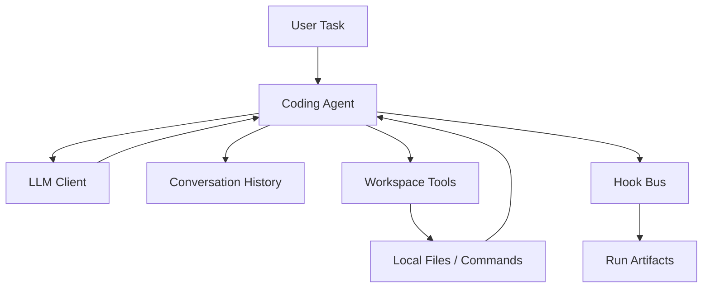

# 项目技术说明

这个项目的目标，是做一个“最小但完整”的 coding agent：它不是把现成 agent 产品包一层 UI，而是自己实现对话循环、工具执行、上下文管理和运行报告。

## 总体架构

## 核心流程

1. 用户输入任务。
2. Agent 把系统提示、历史上下文和任务一起发给模型。
3. 模型决定是直接回答，还是返回 tool calls。
4. Agent 在本地执行工具：读文件、写文件、搜索、替换、运行命令。
5. 工具结果重新注入上下文，继续下一轮。
6. 当模型给出最终答案时，Agent 结束并保存运行报告。

## 关键技术点

- **OpenAI 兼容客户端**
  - 使用轻量 HTTP 请求直接调用 `/chat/completions`。
  - 通过环境变量读取 API key 和 base URL，避免把凭据写进仓库。

- **本地工具层**
  - `read_file`、`write_file`、`list_directory`、`search_text`、`replace_text`、`execute_command` 都是自己写的。
  - 工具层带有工作区边界检查，防止越界访问仓库外文件。

- **上下文管理**
  - 用列表保存消息历史。
  - 按近似 token 预算裁剪上下文，避免对话越跑越大。

- **计划模式**
  - 先让模型输出结构化 JSON 计划。
  - 再按计划进入执行循环，更适合展示复杂任务。

- **Hook / Event 设计**
  - 预留 `before_model_call`、`after_model_call`、`before_tool_call`、`after_tool_call`、`session_end` 等事件。
  - 这类设计借鉴了成熟 agent 项目“可观测、可追踪、可复盘”的思路，但实现是我自己写的。

- **运行报告**
  - 每次运行都会保存 JSON 和 Markdown 报告。
  - 报告里包含最终答案、计划、工具轨迹、事件日志和错误信息。

- **安全性与稳定性**
  - 命令执行有超时限制。
  - 输出会截断，防止无穷增长。
  - 出错后会保留失败报告，方便排查。

## 面试时可以这样讲

- 这个项目最重要的不是“接了一个模型 API”，而是把 agent 的主循环自己实现出来。
- 让我最有成就感的是：模型不只是回答问题，而是真的会读文件、改文件、跑命令、再根据结果继续决策。
- 最终效果接近一个简化版的 Claude Code / Codex，但所有关键逻辑都在本地掌控。
